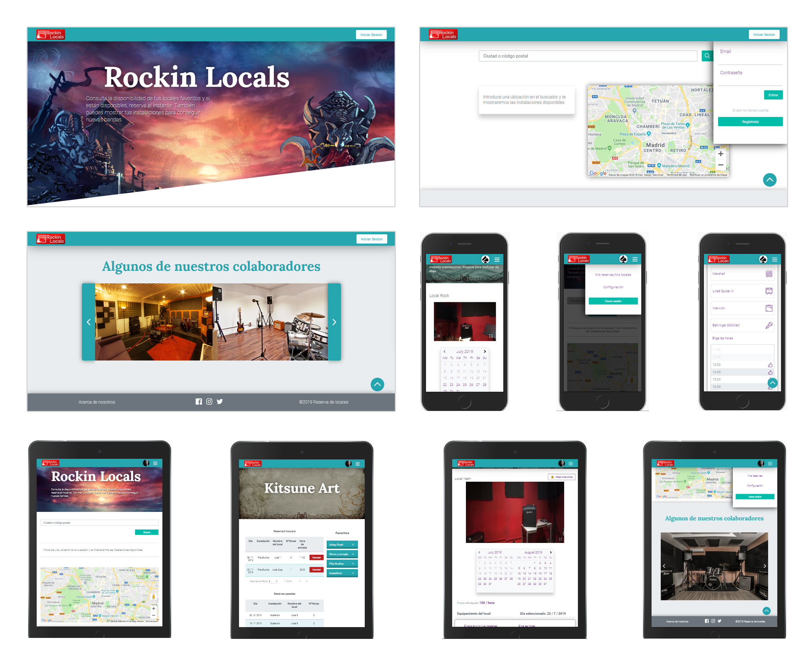

# Rockin Locals

Proyecto realizado en Angular. Api en el repositorio Rockin Locals Api.

## Resumen

Alquiler, gestión de alquiler de locales de ensayo. Registro de usuarios (admin/user), edición, gestión de reservas...

Maquetación HTML5, estilos con Sass y custom properties. Diseño responsive (mobile, tablet y desktop);

## Detalles

Haz npm install. Introduce tu ApiKey en los lugares requeridos para que la aplicación funcione. 

## Detalles de las pantallas

 

